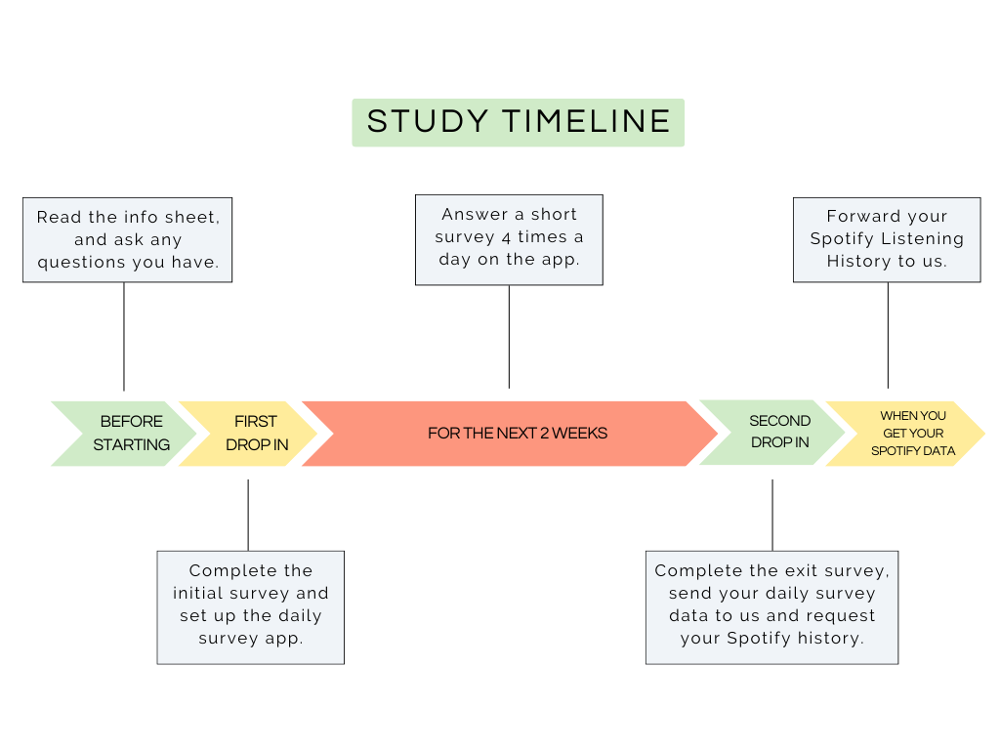

# Mood Music Study Instructions

## Download 'PIEL Survey' on your phone

iPhone Users: [Download from App store](https://itunes.apple.com/au/app/piel-survey/id1257313392?mt=8)  
Android Users: [Download from Google Play](https://play.google.com/store/apps/details?id=au.com.bluejay.pielsurvey)  

Do the sample survey, and make sure your notifications are turned on!

## Load the survey

Click below to download the config file, and open it in the PIEL Survey App. 
Get Nina or Annabel to help with this bit.

[Click here to download the survey](./static/moodmusic.survey)

## Timeline

